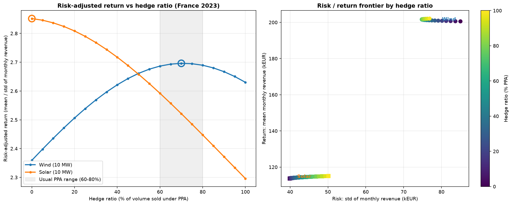

# Renewable Asset Valuation & Hedging Strategy (France 2023)

Reconstructing the P&L of a 10 MW wind/solar portfolio from one full year of hourly RTE generation and EPEX SPOT Day-Ahead data, then testing which PPA/spot hedge ratio gives the best risk-adjusted return.



## Summary

The question I wanted to answer is the one a portfolio manager actually faces: how much of a renewable asset's volume should be locked in a PPA, and how much left exposed to the spot market?

Main results for 2023 (France):

* Average baseload spot: 96.9 EUR/MWh. Solar capture price: 82.0 EUR/MWh (cannibalisation of 15.4%). Wind capture price: 86.3 EUR/MWh (10.9%).
* 147 hours of negative prices, mostly during high-renewable, low-demand periods.
* The spot price tracks residual load (demand minus wind and solar, correlation 0.73) more closely than total demand (0.55): the marginal plant serves what renewables leave uncovered.
* Wind: the risk-adjusted return curve is concave, with an optimum around 70% PPA that cuts the standard deviation of monthly revenue by about 12% at a 2023-level strike.
* Solar: the optimum is 0% PPA at every strike from 60 to 100 EUR/MWh. Solar volume and capture price offset each other month to month (correlation -0.58), a natural hedge that a pay-as-produced PPA removes.
* The strike sets the cost of the hedge, not the risk-adjusted optimum: across 60-100 EUR/MWh the optimal ratio moves by 10 points at most.

## Why this matters

A renewable asset produces the most when its own technology is flooding the grid and pushing prices down, so it is structurally exposed to cannibalisation. The real problem for a producer is not the volume of energy produced but how much risk-adjusted revenue can be secured without giving away the upside during scarcity events. This repo treats the asset as a trading book rather than an engineering spec sheet.

## Method

1. Data engineering (ETL). Loaded raw RTE generation (15 min) and EPEX SPOT Day-Ahead prices. Handled separator and encoding ambiguity, parsed RTE's month-first dates explicitly, interpolated the empty quarter-hour rows (genuine zeros such as solar at night are kept), handled the two daylight-saving hours, resampled production to hourly and inner-joined it to prices into a single hourly dataset.

2. System fundamentals. French load is 46% higher in January than in July, which is the structural driver of winter price tension. I also plotted the daily generation mix (nuclear, hydro, renewables) against demand.

3. Peak-load stress test. The annual peak was 83.8 GW on 23 January 2023 at 19:00, clearing at 223 EUR/MWh. Wind and solar covered only 9.8% of that peak, so the price was set by the residual load, which is what the marginal thermal plant has to serve. This is the merit-order logic made concrete.

4. Capture prices and cannibalisation. Volume-weighted capture price per technology against the simple baseload average, computed monthly and annually, to quantify the discount each technology suffers from producing in its own low-price hours.

5. Hedging and risk optimisation. National generation was scaled to a 10 MW asset (scaled so that annual peak output equals 10 MW). I then swept the hedge ratio from 0 to 100% PPA and, for each level, computed the mean and standard deviation of monthly revenue and their ratio as a risk-adjusted return measure. PPA strikes are set at 2023 market levels, taken from the average prices awarded in the French CRE tenders: 83 EUR/MWh for solar (ground-mounted PV, 82-85 EUR/MWh in 2023) and 87 EUR/MWh for wind (onshore, 86.9 EUR/MWh). A sensitivity analysis then sweeps the strike from 60 to 100 EUR/MWh.

## Findings

Cannibalisation was clear in 2023. Solar lost 15.4% against baseload, wind 10.9%. Solar suffers more because all its output is concentrated in the same midday hours, while wind output is spread over the day and leans towards winter, when prices are higher.

Per MWh, wind was worth more than solar under every strategy (86.3 vs 82.0 EUR/MWh merchant). In absolute terms the gap is larger, mainly because wind has a higher load factor.

Wind has an interior optimum. The curve is flat between roughly 60% and 90% PPA, with a peak around 70%: over-hedging gives away the scarcity upside, under-hedging leaves the book too volatile. A 70% PPA / 30% spot book cuts the standard deviation of wind revenue by about 12% at 87 EUR/MWh while keeping merchant exposure to cold-snap spikes. At that strike, the PPA was also slightly above the 2023 wind capture price (86.3 EUR/MWh).

Solar does not, and the strike is not the reason. The optimum stays at 0% PPA for every strike from 60 to 100 EUR/MWh. Months with high solar output (summer) are months with low capture prices, so merchant revenue is more stable than volume alone (mean/std of 2.85 against 2.30 for a 100% PPA). A pay-as-produced PPA fixes the price and leaves the full seasonal volume swing, so it raises relative volatility.

The strike sets the cost of the hedge, not the risk-adjusted optimum. Because mean/std does not change when revenues are rescaled, a different strike only rescales the PPA leg: the optimal ratio moves by a few points, while the EUR/MWh given up or gained against merchant changes a lot (from -22 to +18 EUR/MWh for solar across the range).

This does not mean a solar producer should stay merchant. Within one year, the metric treats the predictable seasonal shape as risk and ignores what a solar PPA is bought for: protection against a fall in the level of capture prices from one year to the next and against growing cannibalisation.

## Limitations

* Single year (2023), so the results depend on the price regime. This is not a walk-forward backtest across several environments.
* The risk metric (standard deviation of 12 monthly revenues) mixes genuine uncertainty with the predictable seasonal shape of production. A better version would measure deviation from an expected monthly profile estimated over several years.
* The 10 MW asset uses the national fleet profile as a proxy. Scaling to peak output rather than installed capacity overstates load factors (19% solar, 32% wind here, above the real fleet). Capture prices and hedge ratios are unaffected; absolute revenues are overstated.
* PPA strikes are proxied by 2023 CRE tender prices (contracts for difference), not by tenor or shape-adjusted bilateral PPA prices.
* Day-Ahead only, with no intraday or imbalance settlement.

## Changelog

* v2 (October 2026): fixed a date-parsing bug. RTE dates are month-first; parsing them day-first swapped day and month for the first twelve days of each month, misaligning volumes and prices. Also stopped interpolating genuine zeros and recovered the daylight-saving hours. PPA strikes moved from assumed values (65/75 EUR/MWh) to 2023 CRE tender levels (83/87 EUR/MWh), with a strike sensitivity analysis. All results above are from v2.

## How to run

```
pip install -r requirements.txt
jupyter notebook Renewable_Asset_Valuation_2023.ipynb
```

## Tech stack

Python, Pandas (time series), NumPy (vectorised P&L), Matplotlib.
Data: RTE Open Data (generation and load), EPEX SPOT Day-Ahead (ENTSO-E Transparency Platform).

## Author

Yanis Allas. [LinkedIn](https://www.linkedin.com/in/yanis-allas-5600b4294/)
